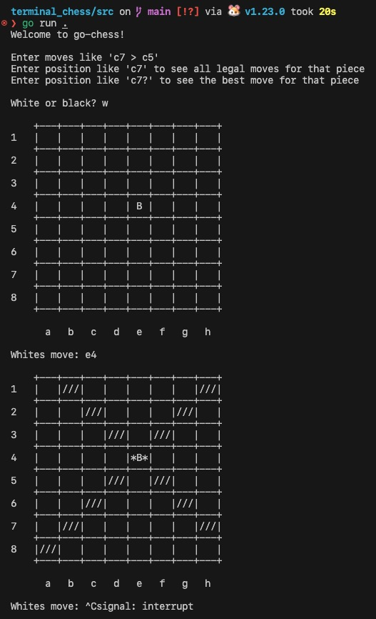

# go-chess

Chess engine and terminal board written in Go.

The main resources I've been using to learn have been the [chess programming wiki](https://www.chessprogramming.org) and Sebastian Lague's chess videos ([1](https://www.youtube.com/watch?v=U4ogK0MIzqk), [2](https://www.youtube.com/watch?v=_vqlIPDR2TU), [3](https://www.youtube.com/watch?v=Ne40a5LkK6A)).

Not really sure why I'm using Go. If I wanted to learn new language for this project I'd probably use Rust, but I know Go well enough that I can jump right in even if my codes a little funky while I get adjusted. I do not like `fmt.Println()` but I'm not really sure why. Overall though I'm enjoying the language. I'm already running into some fun quirks like making sets with `make(map[string]struct{})` that I like for some reason.

## Progress

### Sep 5, 2024

For now, I'm just working on the board representation. I'm hoping this won't take too long, but I'm almost definitely underestimating it. I've started on setting up the rules for identifying valid moves, but haven't gotten very far.

One of the next things I'm gonna look into is [Perft](https://www.chessprogramming.org/Perft).

### Sept 13, 2024

Been getting a little busy with schoolwork, but hoping to really get back into this project again.

Working on getting all legal moves for each piece type. Feel like things are still a little sloppy, so I wanna clean things up soon.

